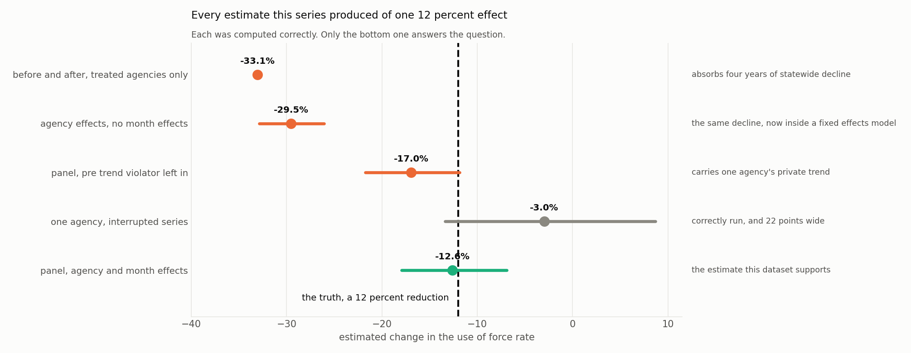

# Module 14: Reporting, and Work That Outlives You

> **Developed by Yin Zhang, PhD**, Assistant Professor, Department of Mathematics and Statistics, Washington State University

**The question this module answers:** *What is an analysis entitled to claim, and will anyone be able to run it again in two years?*

---

## The Question

This module has no new method in it. It is about the two things that decide whether any of the previous thirteen were worth doing.

Both are unglamorous. Both are where analyses most often fail, and neither is recoverable after the fact.

## Every Answer This Series Gave To One Question

The dataset contains one programme with one true effect: a **12 percent reduction**.

| How it was estimated | Estimate | 95 percent interval | Where |
|---|---|---|---|
| Before and after, treated agencies only | **−33.1%** | | Beginner [Topic 18](../Beginner/Topic_18_Year_Over_Year_Comparison.md) |
| Agency effects, no month effects | −29.5% | [−32.9, −26.1] | [Module 10](Module_10_Panel_And_Hierarchical.md) |
| Panel, pre trend violator left in | −17.0% | [−21.8, −11.8] | [Module 10](Module_10_Panel_And_Hierarchical.md) |
| One agency, interrupted series | −3.0% | [−13.4, +8.7] | [Module 11](Module_11_Interrupted_Time_Series.md) |
| **Panel, agency and month effects** | **−12.6%** | **[−17.9, −6.9]** | [Modules 10](Module_10_Panel_And_Hierarchical.md) and [11](Module_11_Interrupted_Time_Series.md) |

**Every one of these was computed correctly.** None involved an error of arithmetic, a coding bug, or a misapplied formula. They range from a 33 percent reduction to a 3 percent reduction, and they differ only in which sources of variation the analyst chose to account for.

That is the argument for the whole series. The difference between the first row and the last is not skill with software. It is knowing that a secular trend exists, that one agency was already improving, and that a single agency cannot resolve an effect this size.

## What You Are Entitled To Claim

| You may say | You may not say |
|---|---|
| the rate fell 12.6 percent relative to comparison agencies | the programme cut use of force by 12.6 percent |
| the interval runs from 17.9 to 6.9 percent | the effect is 12.6 percent |
| pre programme trends were similar after excluding one agency | the parallel trends assumption holds |
| the data cannot distinguish a step from a gradual change | the effect arrived immediately |
| no effect was detected at Orrindale | there was no effect at Orrindale |
| this is consistent with the programme working | this shows the programme works |

The right hand column is not pedantry. Each of those sentences has been written in a real report, and each asserts something the analysis did not establish.

**The single most important sentence in any evaluation report states what the study could not have detected.** Without it, a null result reads as evidence of absence, and every reader will make that mistake.

## The Report Itself

| Section | Contains | Common failure |
|---|---|---|
| **The headline** | one number, one interval, one window | a point estimate with no interval |
| **The picture** | the series, with the intervention marked | a bar chart of two averages |
| **The comparison** | who the comparison group is and why | "compared to last year" |
| **What was excluded** | every agency, month and record dropped, with reasons | silence |
| **What could not be detected** | the smallest effect the design could have seen | silence |
| **The alternatives** | what else changed at the same time | silence |
| **Reproduction** | where the code and data are | "available on request" |

The four rows marked silence are the ones dropped for length. They are the only rows a careful reader uses to decide whether to believe the first one.

## Numbers In Prose

**Give the count next to the rate.** "The rate rose 50 percent" and "it went from two incidents to three" are the same fact. Only one is honest about the evidence. Beginner [Topic 5](../Beginner/Topic_05_Counts_And_Rates.md) is entirely about this.

**Round to the precision you have.** An interval from 17.9 to 6.9 does not support "12.63 percent". Two significant figures is almost always the limit.

**Name the denominator every time.** At Ashfell, over the same months from the same records:

| | 2019 | 2025 onward | Change |
|---|---|---|---|
| Counts | 117.1 a month | 90.1 a month | **−23.1%** |
| Rate | 2.99 per 100 arrests | 2.18 | **−27.1%** |

Four percentage points apart. The gap is the arrest trend and nothing more, since a rate's trend is the count's trend minus the denominator's. Four points is enough to change a sentence, and enough that a reader given one number who assumes the other has been misled. **Both numbers are correct. A report that prints one without naming which it is, is not.**

## Work Someone Else Can Run

The test is specific: **a colleague with your repository and no access to you reproduces every number in the report.** Most analyses fail it within a year, usually because of something small.

| Practice | The failure it prevents |
|---|---|
| Seed every random operation | results that change on rerun |
| Pin library versions | a silent change in a default argument |
| Read data from one canonical file, never from a modified copy | numbers nobody can trace |
| Never edit data by hand | an unrecorded change |
| Put exclusions in code, with a comment giving the reason | "that month was dropped, probably" |
| One script that runs end to end | figures that no longer match the text |
| Commit the figures with the code that made them | a chart nobody can rebuild |
| Write the data dictionary before the analysis | a column whose meaning is now a guess |

This repository is arranged that way and is worth inspecting as an example rather than a lecture. [Data/generate_synthetic_wadeps.py](../../Data/generate_synthetic_wadeps.py) is seeded and produces every CSV; [Data/verify_ground_truth.py](../../Data/verify_ground_truth.py) checks that all eleven planted patterns are still recoverable; each level's `make_figures.py` rebuilds every image from the same source.

Print the environment in every analysis. It costs four lines and it is the difference between "the numbers changed and nobody knows why" and "the numbers changed because statsmodels 0.14 altered a default."

## The Checklist

**The data**
- [ ] Every excluded record is excluded in code, with a reason in a comment
- [ ] The calendar is complete and missing months are missing, not zero
- [ ] Provisional months are labelled and excluded from fitting
- [ ] Counts and denominators come from the same source and period

**The model**
- [ ] The intervention date was fixed before any estimate was seen
- [ ] Residuals were checked for autocorrelation and for seasonal pattern
- [ ] Dispersion was checked, and any excess was diagnosed rather than absorbed
- [ ] Coefficients you did not care about were read anyway
- [ ] A comparison group exists, and its pre period trend was tested

**The claim**
- [ ] The interval is reported, not just the estimate
- [ ] The window the estimate applies to is stated
- [ ] The smallest detectable effect is stated
- [ ] Counts appear next to rates
- [ ] Nothing causal is claimed that the design cannot support

**The record**
- [ ] One script reproduces every number and figure
- [ ] Versions and seeds are recorded
- [ ] Someone else has run it

## Do It Yourself

> 📓 **Notebook:** [Module_14_Reporting_And_Reproducibility.ipynb](Notebooks/Module_14_Reporting_And_Reproducibility.ipynb)
> 
> About 30 minutes.

The exercise is to write the paragraph for the last row of the table above, then check it against the checklist.

## Where This Goes Next

Everything in these fourteen modules estimates **association**, described carefully, with honest uncertainty. The question underneath every one of them was causal, and none of them answered it.

The [Causal Inference series](../../Causal_Inference/) takes up what this one kept deferring: what a counterfactual is, when a comparison group earns the name, what selection on the outcome does to an estimate, and what can be claimed when an intervention was not assigned at random.

## Further Reading

- Gelman, A. and Loken, E. (2014). The statistical crisis in science. *American Scientist*, 102. On specification search without any intent to deceive.
- Wilkinson, L. and the APA Task Force on Statistical Inference (1999). Statistical methods in psychology journals: guidelines and explanations. *American Psychologist*, 54. Still the best short guide to reporting.
- Peng, R. D. (2011). Reproducible research in computational science. *Science*, 334.
- Nosek, B. A. et al. (2018). The preregistration revolution. *PNAS*, 115.

---

| | |
|---|---|
| **Previous** | [Module 13: Intervention Analysis and Transfer Functions](Module_13_Intervention_Analysis.md) |
| **Next** | the [Causal Inference series](../../Causal_Inference/) |
| **Builds on** | every module in this series |
| **Used again in** | every analysis you publish |

*This module is part of a series developed for the Washington Data Exchange for Public Safety (WADEPS) through the Center for Interdisciplinary Statistical Education and Research (CISER) at Washington State University. Version 1.0, September 2026. Questions, errors, or suggestions: yin.zhang@wsu.edu*

*All examples use synthetic data created for teaching. They do not represent any real jurisdiction, agency, officer, or incident. See [Data/DATA_DICTIONARY.md](../../Data/DATA_DICTIONARY.md).*
