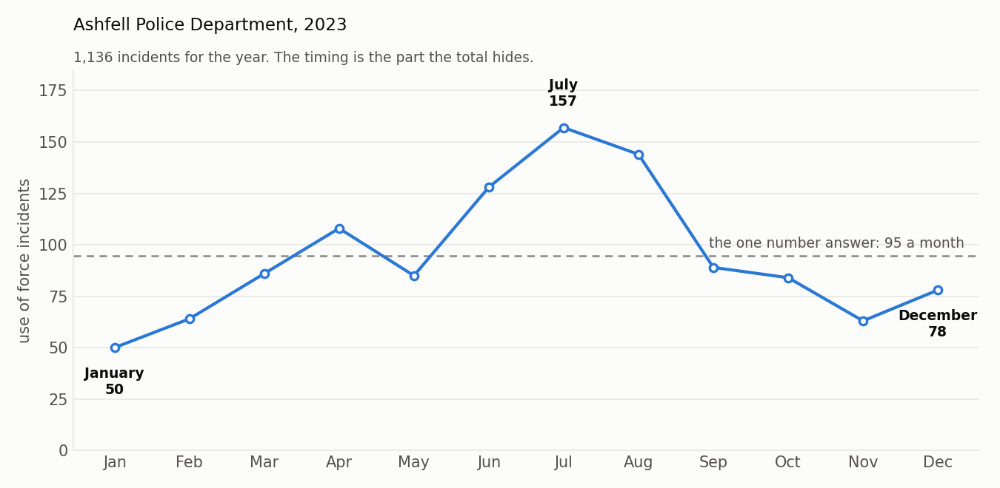

# Topic 1: What Is a Time Series?

> **Developed by Yin Zhang, PhD**, Assistant Professor, Department of Mathematics and Statistics, Washington State University

**The question this module answers:** *A police department reports 1,136 use of force incidents for the year. What does that number actually tell you?*

---

## The Core Concept

A **time series** is a sequence of values recorded at regular points in time: once a month, once a week, once a day.

The word that matters is *sequence*. A time series does not just tell you **how many**. It tells you **when**, and it keeps the order, so you can see what came before what.

## Why It Matters

Someone asks how the year went. It could be a commander, a reporter, a council member, or a resident at a community meeting. There are two ways the question can be answered.

**The one number answer.** "There were 1,136 use of force incidents." True, and almost useless. It cannot tell you whether the year got better or worse, whether anything you did made a difference, or what to expect next year.

**The time series answer.** "The year started at 50 a month, climbed to 157 in July, and came back down to 78 by December." Now there is something to act on. Someone will ask what happened in July. That question is worth asking. The single number never prompts it.

This is not a small difference. Budgets, staffing, and training calendars all get set from answers to questions like this one. An average hides the very thing a decision needs.

## The Example

Ashfell Police Department, 2023. These are the monthly counts behind that annual total of 1,136.

| Month | Jan | Feb | Mar | Apr | May | Jun | Jul | Aug | Sep | Oct | Nov | Dec |
|---|---|---|---|---|---|---|---|---|---|---|---|---|
| **Incidents** | 50 | 64 | 86 | 108 | 85 | 128 | **157** | 144 | 89 | 84 | 63 | 78 |

The dashed line is the one number answer: 95 incidents a month. Notice that the department is almost never at 95. It spends the first part of the year well below it and the middle of the year well above it. The average describes a month that never actually happened.

July had more than three times as many incidents as January. That is the fact worth a meeting.

## What To Watch For

- **A total is not a trend.** Two agencies can report the same annual total while one is improving all year and the other is falling apart.
- **The order is the information.** If you sort the twelve numbers from smallest to largest, you still have all the data and none of the meaning.
- **Regular spacing matters.** A time series assumes each value covers the same length of time. Twelve months is a series. "2019, 2020, first half of 2021" is not.

## 💡 The Insight

An average answers "how much". A time series answers "what is happening". Only the second one tells you whether to do anything.

## Check Your Understanding

<b>1.</b> Two precincts each report 1,200 incidents for the year. Precinct A ran at 100 every month. Precinct B ran at 40 for six months and then 160 for six months. Is the annual total a fair summary of either one?

It is a fair summary of Precinct A and a badly misleading one for Precinct B. Precinct B quadrupled halfway through the year. Something changed there, and the annual total is built so as to hide it. This is the whole reason to keep the sequence.

<b>2.</b> Ashfell averaged 95 incidents a month. In how many months was the count actually within five of 95?

Looking at the twelve values, only September at 89 comes close. Every other month is at least ten away, and most are much further. The average is a real number, but it is not a typical month. That gap between "the average" and "what actually happens" is what the time series makes visible.

## Key Takeaway

Before accepting any public safety number, ask what it looked like month by month. If nobody can tell you, nobody knows whether it is getting better.

---

| | |
|---|---|
| **Next** | [Topic 2: Time Series and Cross Sectional Data](Topic_02_Time_Series_And_Cross_Sectional_Data.md) |
| **Used again in** | [Topic 4: Time Units, Frequency, and Aggregation](Topic_04_Time_Units_Frequency_And_Aggregation.md), [Topic 7: Trend](Topic_07_Trend.md) |

*This module is part of a series developed for the Washington Data Exchange for Public Safety (WADEPS) through the Center for Interdisciplinary Statistical Education and Research (CISER) at Washington State University. Version 1.0, September 2026. Questions, errors, or suggestions: yin.zhang@wsu.edu*

*All examples use synthetic data created for teaching. They do not represent any real jurisdiction, agency, officer, or incident. See [Data/DATA_DICTIONARY.md](../../Data/DATA_DICTIONARY.md).*
