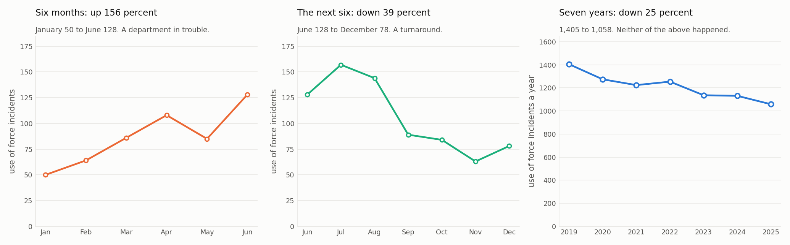

# Topic 12: Short Term Fluctuation and Long Term Change

> **Developed by Yin Zhang, PhD**, Assistant Professor, Department of Mathematics and Statistics, Washington State University

**The question this module answers:** *The same department is up 156 percent, down 39 percent, and down 25 percent. How can all three be true?*

---

## The Core Concept

**Short term fluctuation** is movement within a year: the seasonal rise and fall, plus noise.

**Long term change** is movement across years: a shift in the level the agency operates at.

Both are in every series at once. Which one you see depends entirely on **where you start looking and where you stop**, and that choice is usually made by whoever is presenting.

## Why It Matters

A window is an argument. Choose six months and almost any series can be made to show a crisis or a triumph. Choose seven years and it will usually show something much duller and much more real.

This is not always deliberate. A quarterly report covers a quarter because that is the reporting period, not because a quarter is the right length to answer anything. But the effect is the same: decisions get made on windows that were selected for administrative convenience.

The defence is simple and mechanical. Before accepting any percentage, ask what window it was measured over, then ask to see a longer one.

## The Example

Grandview Police Department. One dataset, three windows, three headlines. Every number below is correct.

| Month | Jan | Feb | Mar | Apr | May | Jun | Jul | Aug | Sep | Oct | Nov | Dec |
|---|---|---|---|---|---|---|---|---|---|---|---|---|
| **2023 incidents** | 50 | 64 | 86 | 108 | 85 | 128 | 157 | 144 | 89 | 84 | 63 | 78 |

**Window one, January to June 2023: up 156 percent.** From 50 to 128 in six months. Written up in June, this is a department losing its grip, and it would be entirely reasonable to demand an explanation.

**Window two, June to December 2023: down 39 percent.** From 128 to 78. Written up in December, this is a successful intervention, and whoever was in charge from July onward would have a strong claim to it.

**Window three, 2019 to 2025: down 25 percent.**

| Year | 2019 | 2020 | 2021 | 2022 | 2023 | 2024 | 2025 |
|---|---|---|---|---|---|---|---|
| **Incidents** | 1,405 | 1,274 | 1,224 | 1,254 | 1,136 | 1,131 | 1,058 |

Neither of the first two things happened. Grandview did not lose control in the first half of 2023 and did not turn itself around in the second half. It went through the same summer it goes through every year, on a level that has been drifting down slowly for seven years. Windows one and two are both entirely composed of [seasonality](Topic_08_Seasonality.md).

## What To Watch For

- **Always ask what window.** "Up 156 percent" is not a fact until it comes with a start date and an end date.
- **Beware windows that begin at a low point or end at a high one.** Starting at January and ending at June guarantees a rise for almost every agency in this dataset. That is the calendar, not the department.
- **Compare a window to the same window in previous years.** January to June 2023 rose 156 percent. What did January to June 2022 do? That comparison is meaningful. The raw percentage is not.
- **Short windows favour whoever is currently in charge.** A new commander who arrives in June will preside over the seasonal decline no matter what they do.
- **Long term change is slow and unglamorous.** Grandview's real achievement is about 4 percent a year for seven years. It will never produce a headline, and it is far more valuable than anything in windows one or two.

## 💡 The Insight

Zoom in and you see the calendar. Zoom out and you see the agency. Almost every argument about public safety numbers is really an argument about the zoom level.

## Check Your Understanding

<b>1.</b> A commander takes over in July 2023 and reports in December that incidents fell 39 percent under their leadership. What would you ask for?

The same six months in the previous three years. Grandview falls from its July peak to December every single year, so a decline over exactly that window is the normal state of affairs. The meaningful question is whether the fall was larger than usual, which means comparing July to December 2023 against July to December 2022 and 2021. The raw 39 percent, on its own, is a claim about the calendar.

<b>2.</b> Which is the better measure of whether Grandview is improving: the 39 percent fall in the second half of 2023, or the 25 percent fall across seven years?

The seven years, even though the number is smaller. The 39 percent is a within year movement that reverses itself every January, so it says nothing about the level the agency operates at. The 25 percent is a change in that level, sustained across seven consecutive years. Size is not strength. A smaller change that persists is much stronger evidence than a bigger one that repeats annually.

<b>3.</b> Would January to June 2024 also show a large rise for Grandview?

Almost certainly, and it would tell you nothing new. The rise from winter to summer is structural in this data. Any report built on a January to June window will find it every year, in every year the agency exists, regardless of what anyone does. A window that produces the same answer no matter what happened is not measuring anything.

## Key Takeaway

Ask what window the percentage came from, then ask for a longer one. If the conclusion changes, the window was the finding.

---

| | |
|---|---|
| **Previous** | [Topic 11: Outliers and Spikes](Topic_11_Outliers_And_Spikes.md) |
| **Next** | [Topic 13: Smoothing and Moving Averages](Topic_13_Smoothing_And_Moving_Averages.md) |
| **Builds on** | [Topic 7: Trend](Topic_07_Trend.md), [Topic 8: Seasonality](Topic_08_Seasonality.md), [Topic 9: Cycles and Seasonality](Topic_09_Cycles_And_Seasonality.md) |
| **Used again in** | [Topic 18: Year over Year Comparison](Topic_18_Year_Over_Year_Comparison.md), [Topic 20: How to Read a Time Series Chart](Topic_20_How_To_Read_A_Chart_Checklist.md) |

*This module is part of a series developed for the Washington Data Exchange for Public Safety (WADEPS) through the Center for Interdisciplinary Statistical Education and Research (CISER) at Washington State University. Version 1.0, September 2026. Questions, errors, or suggestions: yin.zhang@wsu.edu*

*All examples use synthetic data created for teaching. They do not represent any real jurisdiction, agency, officer, or incident. See [Data/DATA_DICTIONARY.md](../../Data/DATA_DICTIONARY.md).*
