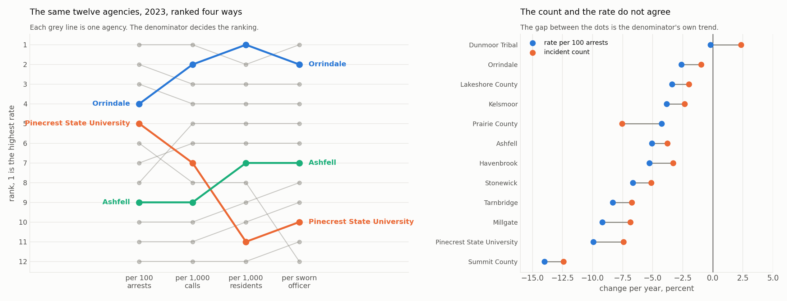

# Module 3: Choosing a Denominator

> **Developed by Yin Zhang, PhD**, Assistant Professor, Department of Mathematics and Statistics, Washington State University

**The question this module answers:** *Per resident, per call, per arrest, or per officer? They give different answers, so which one is right?*

---

## The Question

Beginner [Topic 5](../Beginner/Topic_05_Counts_And_Rates.md) established that a count has to be divided by something. It did not say by what.

That turns out to be the harder question. There are four defensible denominators for use of force, they rank agencies differently, and the choice is not technical. It is a choice about what is being asked.

## The Idea in Plain Language

A denominator is an **exposure**: the amount of opportunity there was for the thing to happen. Different denominators describe different opportunities.

| Rate | The question it answers | Who it is for |
|---|---|---|
| per 100 arrests | when officers take someone into custody, how often is force involved | oversight of officer decisions |
| per 1,000 calls for service | across everything officers are sent to, how often does force result | operational review |
| per 1,000 residents | how much force does this community experience | community and council |
| per sworn officer | how much force does the average officer apply | staffing and workload |

Each is correct for its own question and misleading for the others.

## The Method

```python
rate = numerator / exposure * scale
```

The scale is cosmetic: per 100, per 1,000, per 100,000. Choose whatever makes the typical value a readable number and state it.

Two properties matter when choosing the exposure.

**Does it measure the right opportunity?** Force happens during police contact, so contacts are the natural exposure. Residents are an exposure for *community burden*, which is a different and equally legitimate question.

**Can the agency move it?** An agency chooses how many arrests to make. If it arrests fewer people but behaves identically in the situations it does encounter, its rate per arrest rises with no change in conduct. Calls for service are generated mostly by the public, so they are harder for an agency to influence. Neither denominator is clean, which is why reporting two is the honest default.

## Worked Example

The twelve agencies in 2023, ranked four ways.

| Agency | per 100 arrests | rank | per 1,000 residents | rank |
|---|---|---|---|---|
| Tarnbridge | 3.34 | 1 | 3.57 | 2 |
| Stonewick | 2.96 | 2 | 3.27 | 3 |
| Millgate | 2.94 | 3 | 3.04 | 4 |
| **Orrindale** | 2.89 | **4** | 3.59 | **1** |
| **Pinecrest State University** | 2.83 | **5** | 1.31 | **11** |
| Dunmoor Tribal | 2.81 | 6 | 1.76 | 8 |
| Havenbrook | 2.79 | 7 | 2.85 | 6 |
| Kelsmoor | 2.70 | 8 | 2.97 | 5 |
| Ashfell | 2.32 | 9 | 2.37 | 7 |
| Prairie County | 2.24 | 10 | 1.62 | 9 |
| Summit County | 2.23 | 11 | 1.33 | 10 |
| Lakeshore County | 1.93 | 12 | 1.22 | 12 |

Most agencies move a place or two. Two move a long way, and for instructive reasons.

**Pinecrest State University falls from fifth to eleventh.** Its 29,000 residents are students, most of whom leave in June, and the campus also serves visitors who are in nobody's population count. The denominator does not mean the same thing for a campus force that it means for a city. Ranking a campus agency per resident is close to meaningless.

**Orrindale rises from fourth to first.** It is an eight officer department with 3,900 residents and fourteen incidents in the entire year. A small denominator and a tiny numerator produce a rate that looks alarming and carries almost no information. Whether that number can support a ranking at all is [Module 4](Module_04_Why_Small_Agencies_Look_Volatile.md).

**The coverage trap.** Prairie County submitted only nine months of 2022. Its 2022 **rate** is fine, because incidents and arrests are both short by the same three months and the ratio is unaffected. Its 2022 **count** is not comparable to any other agency's. Rates tolerate coverage gaps; counts do not.

### The denominator moves too

A rate is a ratio, so its trend is the numerator's trend minus the denominator's:

> change in the rate per year **≈** change in the count **−** change in the denominator

That is not a subtlety. Across this dataset arrests grew between about 1.2 and 1.9 percent a year at almost every agency, so **every agency's rate improves by roughly that much before anything about officer behaviour changes.**

| Agency | Incident count | Arrests | Rate per 100 arrests |
|---|---|---|---|
| **Dunmoor Tribal** | **+2.35%** | +1.13% | **−0.21%** |
| Orrindale | −0.96% | +1.30% | −2.61% |
| Lakeshore County | −1.99% | +1.35% | −3.39% |
| **Havenbrook** | **−3.30%** | +1.89% | **−5.28%** |
| Ashfell | −3.77% | +1.33% | −5.06% |
| Stonewick | −5.12% | +1.60% | −6.65% |
| Summit County | −12.43% | +1.47% | −13.99% |

*All figures are log linear trends per year over 2019 to 2025, with the documented Tarnbridge unrest month excluded.*



Two rows are worth reading carefully.

**Dunmoor Tribal recorded more incidents each year, and its rate was flat.** The count rose 2.4 percent a year while arrests rose 1.1 percent, leaving the rate essentially unchanged. A report built on counts would say this agency is deteriorating. A report built on rates would say nothing happened. Both are arithmetically correct and they lead to opposite decisions.

**Havenbrook's rate improved faster than its incidents fell.** The count dropped 3.3 percent a year but the rate dropped 5.3 percent, so **more than a third of the apparent improvement is arrests going up, not incidents coming down.**

The rule that follows is short. **Whenever you report a trend in a rate, report the denominator's trend beside it.** Otherwise a reader cannot tell whether the numerator moved, the denominator moved, or both, and those are three different findings.

One caveat on the arithmetic. The identity is exact for the logarithms of the underlying quantities and approximate for fitted trends, and the approximation loosens for agencies with very small counts, where a month of zero has to be handled before logs can be taken. Prairie County is the visible exception in this dataset.

## Do It Yourself

> 📓 **Notebook:** [Module_03_Choosing_A_Denominator.ipynb](Notebooks/Module_03_Choosing_A_Denominator.ipynb)
> [](https://colab.research.google.com/github/OWNER/REPO/blob/main/Time_Series/Intermediate/Notebooks/Module_03_Choosing_A_Denominator.ipynb)
> Opens in Google Colab, runs top to bottom, about 15 minutes.

The notebook builds all four rates, produces the rank comparison, demonstrates the coverage trap, and ends with a reusable `agency_rates` function that reports the number of months behind each figure.

## Pitfalls

| What goes wrong | What it looks like | What to do |
|---|---|---|
| The denominator goes unnamed | "the rate rose 12 percent" with no way to check it | name it and the scale, every time |
| Numerator and denominator cover different periods | a rate that jumps when an agency has a reporting gap | count the months on both sides and report them |
| Comparing a count to a rate | a large agency always looks worst | compare like with like |
| A denominator the agency controls | a rate that moves when arrest policy changes | report per call as well as per arrest |
| Population used for a non residential agency | campus, transit and tribal forces ranked nonsensically | use contacts, not residents, for those agencies |
| A denominator near zero | enormous rates from tiny agencies | suppress or flag below a minimum exposure, and see Module 4 |
| A rate trend reported without the denominator's trend | an improvement that is really the denominator growing | publish both trends side by side |

## Check Your Understanding

<details>
<summary><b>1.</b> A department reduces arrests by 20 percent and its use of force count falls by 10 percent. What happens to its rate per arrest, and what should be concluded?</summary>

The rate rises by about 12 percent, because the denominator fell faster than the numerator. Whether that is bad depends entirely on why arrests fell. If the department stopped making low risk arrests, the remaining ones are on average more confrontational and a higher rate per arrest is expected with no change in conduct. This is why the rate per call for service, which the department controls less, belongs in the same table.
</details>

<details>
<summary><b>2.</b> Why is ranking Pinecrest State University per 1,000 residents a bad idea, while ranking it per 100 arrests is reasonable?</summary>

Because its resident count does not describe who is exposed to its policing. The student population empties out in summer, and the campus serves visitors and staff who are counted somewhere else. Arrests, by contrast, are actual police contacts made by that agency, so they measure exposure in the same way for Pinecrest as for anyone else. The general rule is to prefer a denominator built from the agency's own activity when the population base is not comparable.
</details>

<details>
<summary><b>3.</b> An agency's use of force count fell 3 percent a year and its rate per arrest fell 5 percent a year. What happened?</summary>

Arrests rose by about 2 percent a year. The rate's trend is the count's trend minus the denominator's, so a gap of two points between them is the denominator moving. Whether that is good news depends on something the numbers do not say: if the agency is making more arrests and using force in a smaller share of them, that is a real improvement in how contacts are handled. If it is making more low risk arrests that were never likely to involve force, the rate has improved without any change in the encounters that matter. Reporting both trends lets a reader ask the question. Reporting only the rate hides it.
</details>

<details>
<summary><b>4.</b> An agency has nine months of data in a year. Which of its 2022 figures can be compared with a twelve month agency, and which cannot?</summary>

Rates can, counts cannot. A rate is a ratio in which both parts cover the same nine months, so the missing quarter cancels. A count is a total over a shorter period and is understated by roughly a quarter. If a count has to be shown, either annualise it and label the estimate, or restrict every agency to the same nine months.
</details>

## Key Takeaway

Say which denominator you used, report at least two, check that both sides of the ratio cover the same months, and when you report a trend in a rate, report the denominator's trend next to it.

---

| | |
|---|---|
| **Previous** | [Module 2: Building an Honest Calendar](Module_02_Building_An_Honest_Calendar.md) |
| **Next** | [Module 4: Why Small Agencies Look Volatile](Module_04_Why_Small_Agencies_Look_Volatile.md) |
| **Builds on** | [Beginner Topic 5](../Beginner/Topic_05_Counts_And_Rates.md), [Module 2](Module_02_Building_An_Honest_Calendar.md) |
| **Used again in** | [Module 12: Building a Peer Benchmark Series](Module_12_Building_A_Peer_Benchmark_Series.md) |

*This module is part of a series developed for the Washington Data Exchange for Public Safety (WADEPS) through the Center for Interdisciplinary Statistical Education and Research (CISER) at Washington State University. Version 1.0, September 2026. Questions, errors, or suggestions: yin.zhang@wsu.edu*

*All examples use synthetic data created for teaching. They do not represent any real jurisdiction, agency, officer, or incident. See [Data/DATA_DICTIONARY.md](../../Data/DATA_DICTIONARY.md).*
