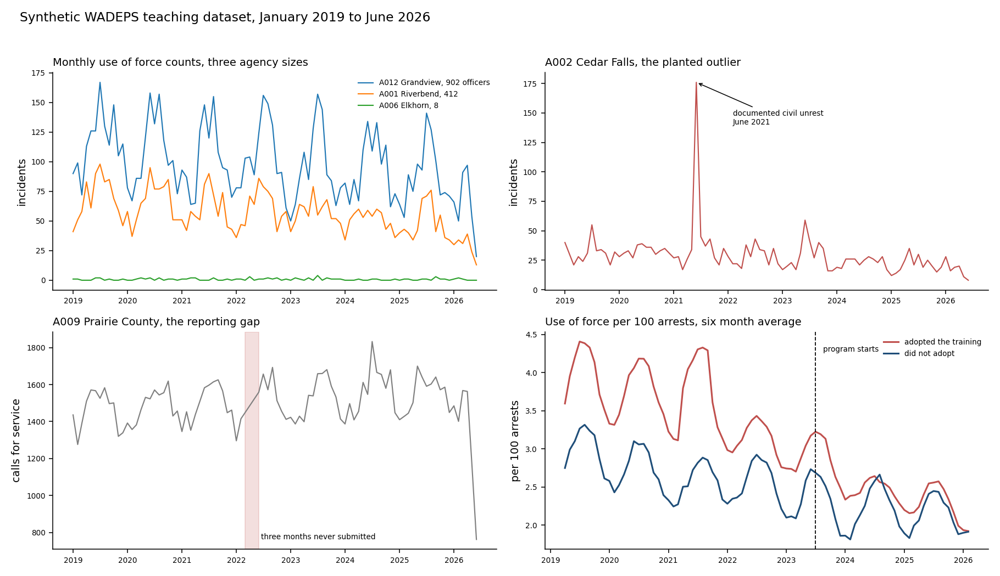

# Time Series for Public Safety Data

*Prepared by Yin Zhang, Center for Interdisciplinary Statistical Education and Research (CISER), Washington State University.*

Three levels, 52 modules. Each level is complete on its own, and each one assumes only the level before it.

| Level | Modules | Assumes | Code | Time |
|---|---|---|---|---|
| **[Beginner](Beginner/)** | 20, all published | Nothing. No statistics, no math, no code. | None | 5 minutes a module |
| **[Intermediate](Intermediate/)** | 16 | You can read a chart and a percentage. | Jupyter notebooks, gentle | 10 minutes plus 15 in the notebook |
| **[Advanced](Advanced/)** | 16 | You have fitted a regression before. | Jupyter notebooks, complete | 20 minutes plus 30 in the notebook |

## Which level are you?

Answer this question: **your monthly use of force count went from 18 to 24. Is that a problem?**

- If you are not sure what would even tell you, start at **Beginner**.
- If you said "it depends on the season and on how many arrests there were", but you would not know how to establish that from a file of records, start at **Intermediate**.
- If you said "I would want to see it against a seasonally adjusted baseline with a prediction interval", start at **Advanced**.

## The data

Every module uses the same synthetic WADEPS dataset. See [Data/DATA_DICTIONARY.md](../Data/DATA_DICTIONARY.md). The answers are known in advance, so each method can be checked against what it was supposed to find. See [Data/GROUND_TRUTH.md](../Data/GROUND_TRUTH.md).

## Where this leads

Time series tells you **what happened and when**. It does not tell you **why**, and it cannot by itself tell you whether a program worked. Advanced Module 13 hands off to the [Causal Inference series](../Causal_Inference/), which takes up that question.

---

*Questions, corrections, or suggestions: yin.zhang@wsu.edu*
